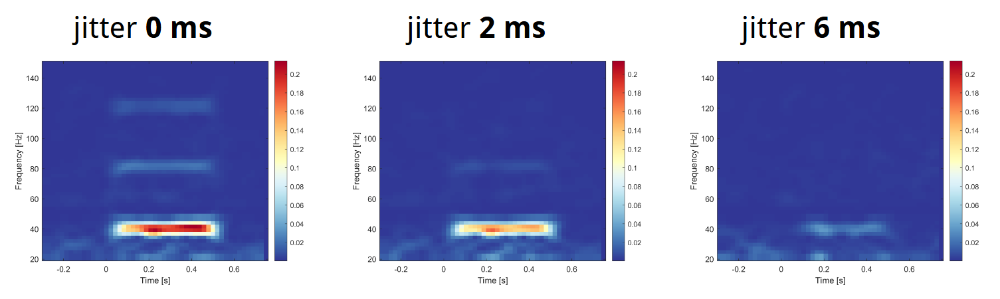

About
=====

Authors
-------

Vlastimil Koudelka and Jan Hubený, National Institute of Mental Health
(NUDZ), Klecany, Czech Republic. Cyril Kaplan joined the team for the
validation and outreach part of the project.

Funding
-------

Developed within the project *Multipurpose event synchronization device for
EEG research and brain computer interface applications*, supported by the
Technology Agency of the Czech Republic (TAČR), programme GAMA, grant no.
TP01010062.

Use
---

The device has been used for more than a year in the NUDZ laboratories,
including daily use in the neurostimulation lab. It has also been tested
with a Magstim-EGI GTEN high-density EEG, a Muse wearable EEG and mBrainTrain
devices.

Jitter Matters
--------------

*Jitter Matters: A Game for Reproducible EEG* shows in a simple game how much
information is lost when technical jitter is introduced. You tap your finger
in a steady rhythm; the steadier the rhythm, the clearer the auditory
steady-state response. It was presented at the NBT forum in Berlin. You can
play it in the browser: :doc:`jitter-matters`.

Presentations
-------------

* nbtBerlin, 17–18 May 2022 (talk)
* LifMat 2022, 8–9 September 2022 (poster)
* 68th Congress of the Czech Society of Clinical Neurophysiology (ČSKN),
  20–21 October 2022 (talk)
* 67th Joint Congress of the Czech and Slovak Society of Clinical
  Neurophysiology, 2021
