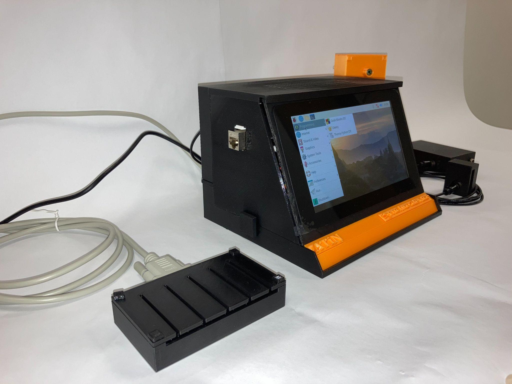

Hardware
========

.. note::

   The schematics, PCB layouts and full bill of materials of the input boards
   are **not published yet**. This page describes the function, interfaces
   and main components of each board, the enclosure and the assembly.

Platform
--------

* Raspberry Pi 4 Model B
* Official Raspberry Pi 7" touchscreen
* Arduino board acting as a USB keyboard emulator
* Two custom input boards (see below), 3.3 V logic outputs connected to the
  Raspberry Pi GPIO
* 12 V DC power input on board #2; the beta design moves to a single common
  power supply for the Raspberry Pi and the input circuits (no battery)
* Ethernet connection to the laboratory network (stimulation PC and
  recording PC)

Both input boards are 4-layer PCBs:

===== ==============
Layer Purpose
===== ==============
TOP   signal
In1   GND
In2   Vcc
BOT   signal
===== ==============

Board #1: Photodiode (screen) sensor
------------------------------------

Detects changes of brightness on the stimulation monitor or projector.

* **Input:** a photodiode connected by a CINCH (RCA) connector. The
  photodiode must be attached to the monitor, almost touching the screen
  (see :doc:`user-guide`).
* **Outputs:** six digital outputs, 0 V / 3.3 V. Each output corresponds to
  a different sensitivity threshold of the light change, so the best
  threshold can be selected for a given screen.
* **Signal chain:** photodiode → op-amp amplifier stage (TLC271) →
  bank of comparators with different thresholds (LM339), threshold trimmed by
  a multi-turn potentiometer → Schmitt-trigger buffers (74HCT14) → outputs.
* **Power:** 3.3 V linear regulator (LF33).
* Test points for the op-amp output and comparator outputs are available for
  calibration with an oscilloscope.

Board #2: Buttons, TTL and audio
--------------------------------

* **Buttons input:** D-sub 9-pin connector for the four-button response box.
* **Audio input:** 3.5 mm jack; the audio is passed through to a 3.5 mm
  output jack so the sound can still go to the headphones/speakers.
* **TTL input:** 2.54 mm Dupont header.
* **Outputs:** six digital outputs, 0 V / 3.3 V: four for the buttons, one
  for audio detection and one for TTL.
* **Main components:** op-amps (TLC271) for the audio detector, an audio
  transformer (TY-141P) on the audio input, an NE555 timer,
  Schmitt-trigger buffers (74HCT14), 3.3 V linear regulator (LF33), status
  LED.
* **Power:** 12 V DC input.

Design notes from development:

* separate power rails with two linear regulators; a higher supply for the
  audio input makes it more sensitive,
* better handling of the voltage levels,
* photodiode output goes through a Schmitt trigger,
* in the beta version the LCD photodiode circuit is integrated into the
  device, with two inputs (LCD and projector) usable separately or together.

Enclosure
---------

The enclosure was designed in 3D and 3D-printed. There are two parts: the
main box (Raspberry Pi, touchscreen, input boards) and a separate box for the
response buttons.

.. list-table::
   :widths: 50 50

   * - .. figure:: images/enclosure-rear-side.png

          Rear/side view

     - .. figure:: images/enclosure-front-side.png

          Front/side view

   * - .. figure:: images/enclosure-rear.png

          Rear view

     - .. figure:: images/enclosure-side.png

          Side view

   * - .. figure:: images/enclosure-front.png

          Front view

     - .. figure:: images/enclosure-buttonbox.png

          Button response box

   The finished prototype: button box (left) and the main device (right).

Assembly outline
----------------

1. Print the main box and the button box.
2. Mount the Raspberry Pi 4 behind the 7" touchscreen in the main box.
3. Mount input boards #1 and #2 and connect their 3.3 V outputs to the
   Raspberry Pi GPIO pins used by the HW server.
4. Connect the Arduino keyboard emulator to the Raspberry Pi and to the USB
   port that goes to the stimulation PC.
5. Bring out the CINCH photodiode input(s), D-sub 9 button connector, audio
   in/out jacks, TTL header, 12 V power and Ethernet on the enclosure.
6. Install the software (:doc:`software`) and verify the latency
   (:doc:`validation`).
