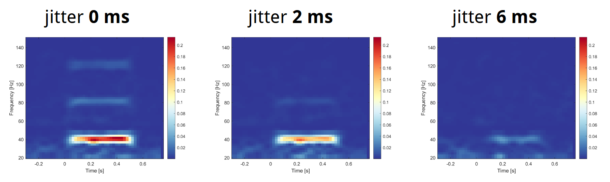
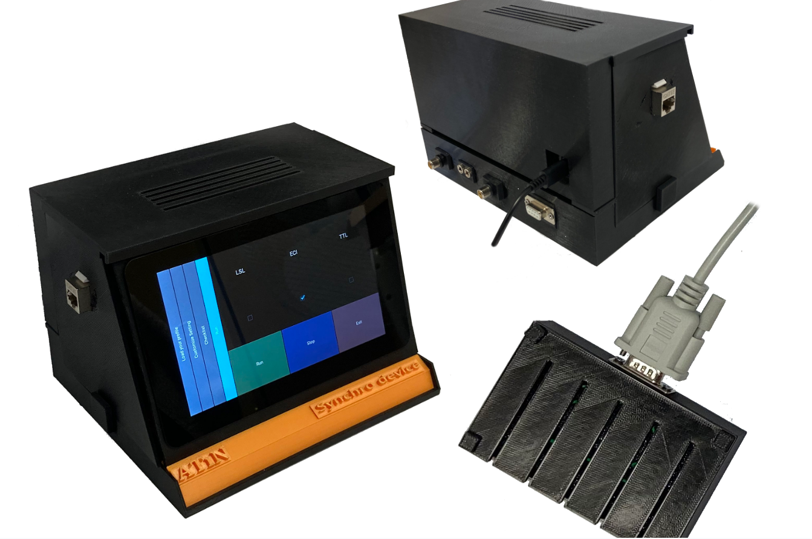

Welcome to Synchro documentation!
===================================

**Synchro** is a tool for bringing more statistical power to EEG experiments, icreasing control, preventing information loss in brain research due to jittering signals,  and eliminating repetitive frustrating tasks.

**Why** is synchronization so important? Random delays in the presentation pipeline cause the stimuli presented to the subject to be jittery. As a consequence, the signal of brain-evoked activity measured by EEG gets lost. We address this issue by incorporating an independent device that ensures precise timing of the stimuli, enabling us to detect more subtle changes in human brain function.

**How** do we approach the problem? The SYNCHRO is an open-source hardware and software solution that enables application-independent functionality, regardless of the operating system or presentation software. To date, the SYNCHRO is capable of:

* Lab Streaming Layer compatible interface						         ✓	
* User interface based on touchscreen and configurable profiles	   ✓
* cross-platform design, TTL outputs for LSL incompatible devices	✓
* validation for event related potential (ERP) based applications	✓
* tested on laboratory and wearable EEG devices					      ✓
* ECI protocol (Magstim-Egi)						                        ✓
* Remote control									                           ✓

Check out the :doc:`usage` section for further information, including
how to :ref:`installation` the project.

.. note::

   This project is under active development.

Contents
--------

.. toctree::

   usage
   api
