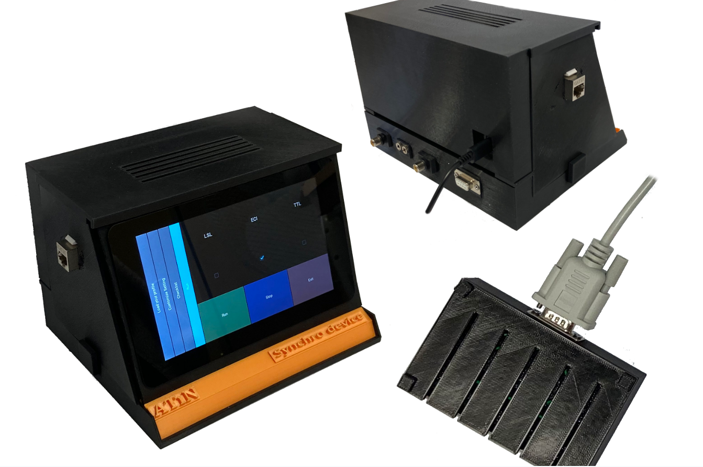

Welcome to Synchro documentation!
===================================

**Synchro** is a tool for bringing more statistical power to EEG experiments, increasing control, preventing information loss in brain research due to jittering signals, and eliminating repetitive frustrating tasks.

**Why** is synchronization so important? Random delays in the presentation pipeline cause the stimuli presented to the subject to be jittery. As a consequence, the signal of brain-evoked activity measured by EEG gets lost. We address this issue by incorporating an independent device that ensures precise timing of the stimuli, enabling us to detect more subtle changes in human brain function. Try it yourself in the :doc:`Jitter Matters game <jitter-matters>`.

.. figure::  images/jitterMatters.png
   :align:   center

**How** do we approach the problem? The SYNCHRO is an open-source hardware and software solution that enables application-independent functionality, regardless of the operating system or presentation software. The device detects real-world events (a change on the screen, a sound, a button press, an external TTL pulse) with its own sensors and forwards precisely time-stamped markers to the recording system. To date, the SYNCHRO is capable of:

* Lab Streaming Layer compatible interface                           ✓
* User interface based on touchscreen and configurable profiles      ✓
* cross-platform design, TTL outputs for LSL incompatible devices    ✓
* validation for event related potential (ERP) based applications    ✓
* tested on laboratory and wearable EEG devices                      ✓
* ECI protocol (Magstim-EGI)                                         ✓
* Remote control                                                     ✓

Measured hardware latency is below 100 µs, and the median latency including
the LSL network layer is about 120 µs (worst case 0.65 ms). See
:doc:`validation` for details.

.. note::

   This project is under active development. The electronic schematics and
   PCB layouts of the input boards are not published yet. This documentation
   describes everything else needed to understand, build and use the device.

Contents
--------

.. toctree::
   :maxdepth: 2

   overview
   hardware
   software
   user-guide
   validation
   jitter-matters
   dev-notes
   about
