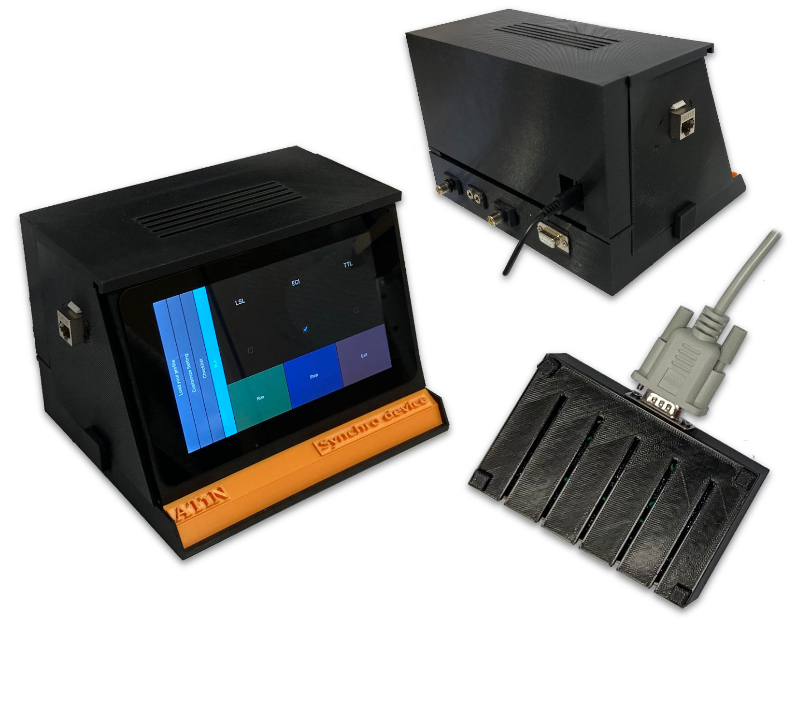
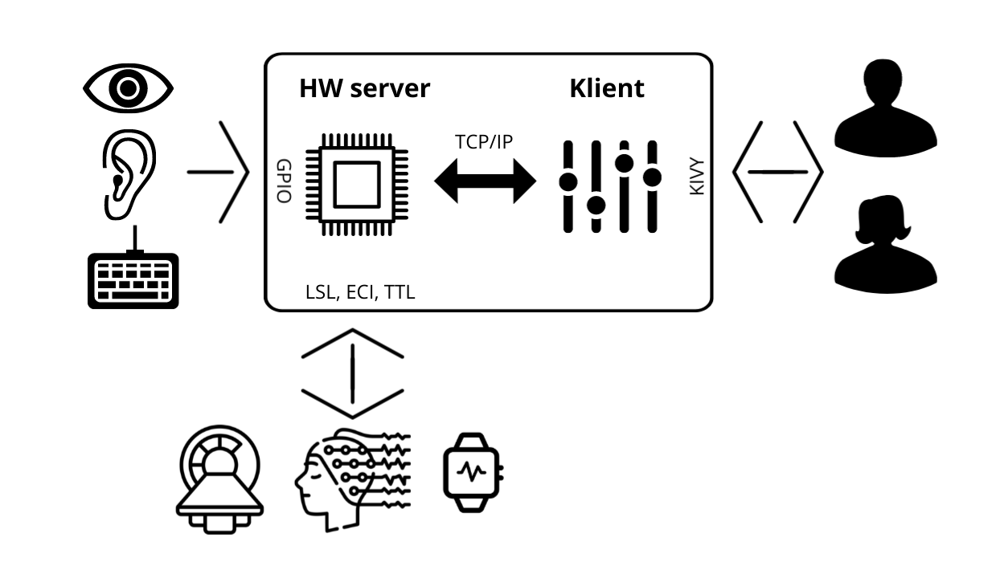

System overview
===============

Goal
----

The goal of the project was to build a precise device that synchronizes
biosignal data streams (high-density EEG, wearable EEG, eye tracking, fMRI and
any device supporting the Lab Streaming Layer (LSL) or TTL) with real-world
events, with latency below one millisecond.

Inaccurate synchronization is often overlooked by researchers, which lowers
the sensitivity of experiments. When it is addressed, it is usually solved
ad hoc, which costs time, makes the setup fragile, and makes the experiment
harder to extend and reproduce. Precise synchronization lowers the noise in
the data and therefore increases reproducibility and statistical power. It
also gives more control over the experiment and automates the repetitive
work of testing the timing.

   The Synchro device 1.0 prototype with the button response box.

Requirements and their status
-----------------------------

=============================================================== ======
Requirement                                                     Status
=============================================================== ======
Lab Streaming Layer compatible interface                        ✓
3T MRI scanner compatibility                                    ✗
User interface based on touchscreen and configurable profiles   ✓
Cross-platform design, TTL outputs for LSL incompatible devices ✓
Validation for event related potential (ERP) based applications ✓
Tested on laboratory and wearable EEG devices                   ✓
ECI protocol (Magstim-EGI)                                      ✓
Remote control                                                  ✓
=============================================================== ======

MRI compatibility was not implemented. The effort went into integration with
the Magstim-EGI system (ECI protocol) instead.

Key features of the prototype
-----------------------------

* Standalone time synchronization device for neuroscience applications.
* Raspberry Pi 4 platform with the official 7" touchscreen and a graphical
  user interface.
* Lab Streaming Layer (LSL) and Experiment Control Interface (ECI) protocols,
  plus TTL output for devices that support neither.
* USB keyboard emulator (Arduino based).
* Inputs: four-button response pad, one audio input, one photodiode input
  for an LCD screen and one photodiode input for a data projector, TTL input.
* A multi-threaded TCP/IP server, so the device can be remotely controlled
  and integrated into many laboratory setups.
* Modular system, open to further software development in Python or C.

Block diagram
-------------

   Sensors (light, sound, responses) feed the HW server, which talks to the
   recording systems over LSL, ECI or TTL. The client (GUI) and any remote
   client control the HW server over TCP/IP.

The device consists of three layers:

1. **Input circuits** (:doc:`hardware`): analog/digital front-end boards that
   turn real-world signals (light from a screen, sound, a button press,
   external TTL) into clean 0–3.3 V digital edges.
2. **Raspberry Pi 4**: the edges trigger GPIO interrupts; the interrupt
   handler immediately sends a marker over the selected protocol.
3. **Software** (:doc:`software`): the HW server (interrupts + protocols +
   TCP/IP server) and the client (touchscreen GUI).
