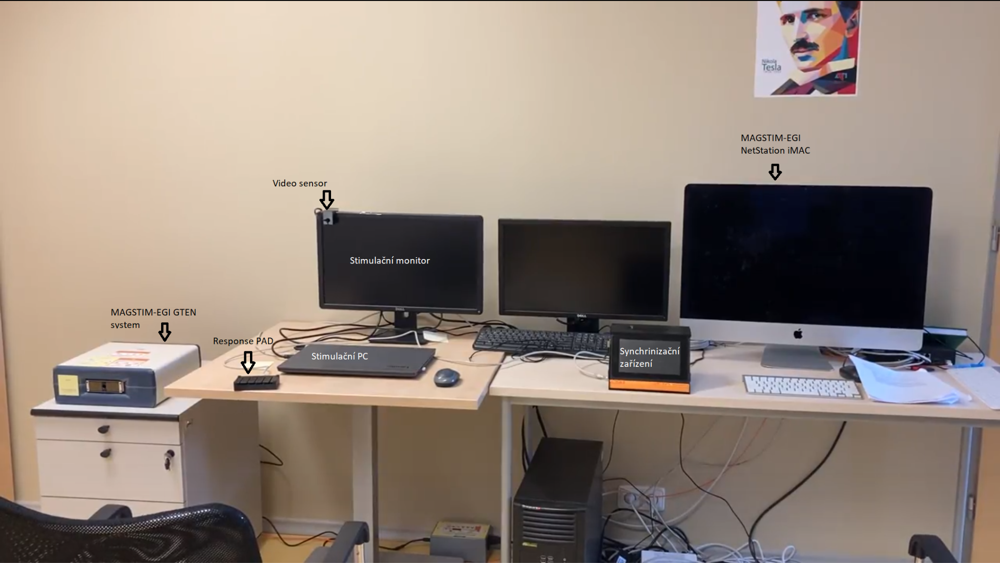
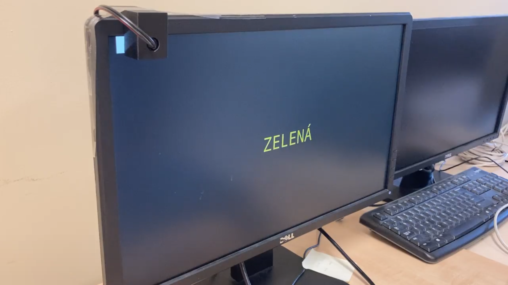
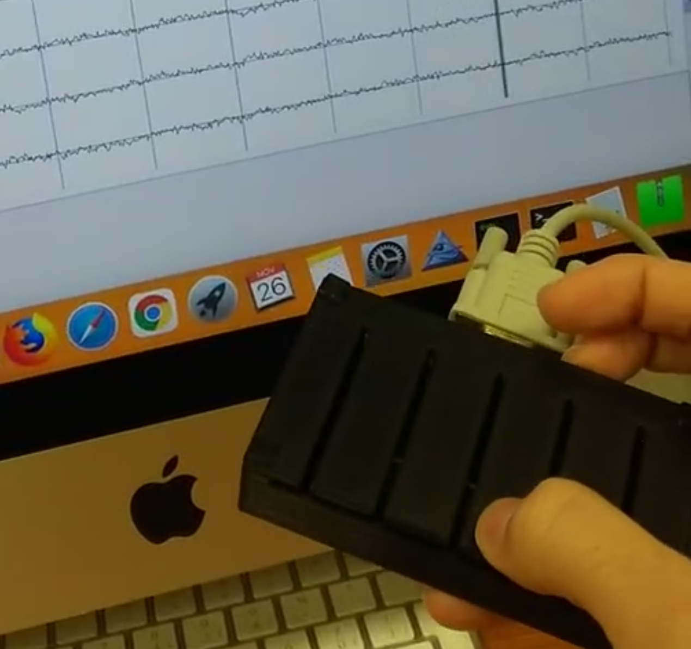
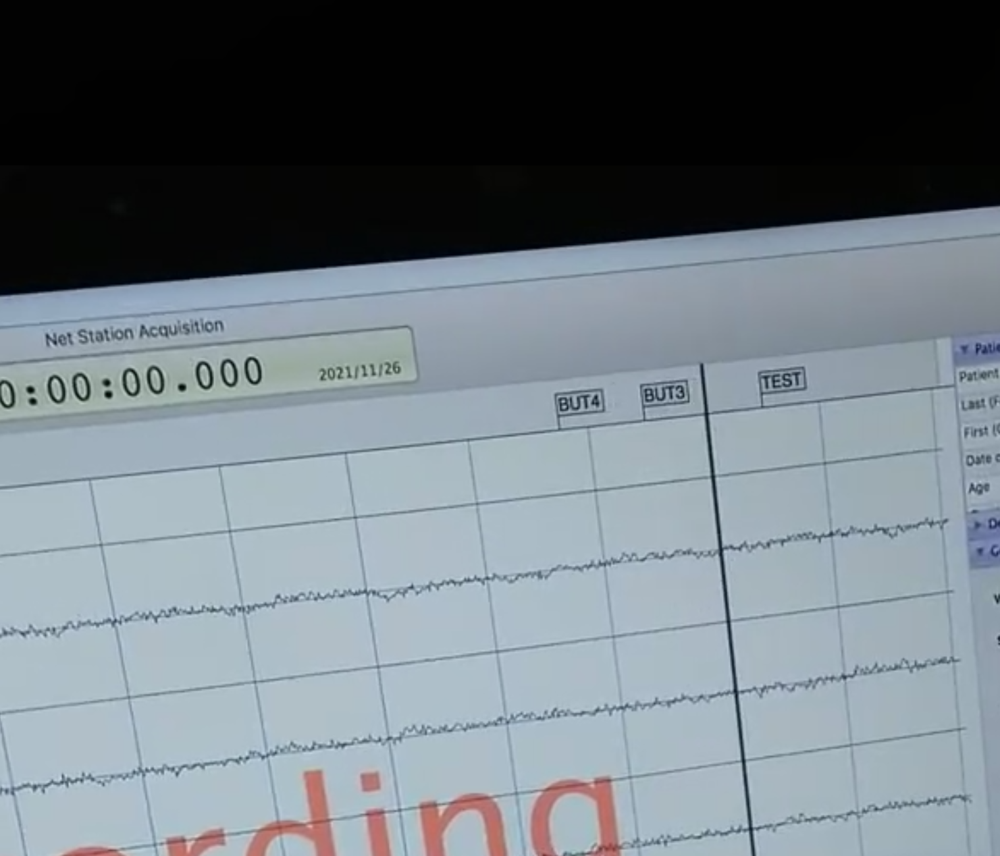

User guide
==========

The user works with the device on its touchscreen. The main menu is a wizard
that leads through an experiment.

Experiment wizard
-----------------

A. **Load profile:** load the profile of the experiment.
B. **Customize setting:** connect every sensor to the protocols it should
   use, with the connectivity matrix.
C. **Checklist:** read the instructions and notes that belong to the
   profile. This is when the sensors are physically connected and placed.
   The notes are a text file and can be changed in any text editor.
D. **Run:** connect to the external devices, check the connection with a
   simple test event, and start the measurement.

.. list-table::
   :widths: 50 50

   * - .. figure:: images/gui-profile.png

          A: load profile

     - .. figure:: images/gui-matrix.png

          B: sensor × protocol matrix

   * - .. figure:: images/gui-checklist.png

          C: checklist

     - .. figure:: images/gui-connect.png

          D: connect and test

Sensors
-------

The prototype has light, sound and response sensors. In step B each of them
is linked to a protocol, i.e. to the device that records the biosignals:

* **Screen sync:** photodiode attached to the stimulation screen.
* **Audio sync:** audio input (the sound is passed through to the output).
* **Response sync:** the four-button response box.

Example: visual evoked potentials (VEP) lab setup
-------------------------------------------------

For VEP the video sensor and the response buttons are used. The device is
connected through a network switch to both the stimulation PC and the EEG
recording computer (Magstim-EGI NetStation on an iMac).

   Measurement setup for VEP.

   Placing the photodiode (video sensor) on the monitor. It has to almost
   touch the screen. The stimulation program draws a test patch under it
   (our tests used a patch of 122 lux).

Starting the software and basic test
------------------------------------

After connecting the device to the network, start the two programs from the
``SyncTools`` menu: ``ServerStart`` (HW server) and then ``SyncStart``
(GUI client).

.. list-table::
   :widths: 50 50

   * - .. figure:: images/start-menu.jpg

          Starting the server and the client

     - .. figure:: images/start-server-log.jpg

          The server lists all remote connections

   * - .. figure:: images/start-connect-test.png

          Run screen: Connect and Test buttons

     - .. figure:: images/start-netstation-event.png

          The test event arrives in NetStation

   Testing the fully integrated device with the Magstim-EGI system.

Checklist for a session
-----------------------

1. Place the device near the stimulation equipment.
2. Power up the device and start the HW server and the client.
3. Load the profile and read the instructions in the *Checklist* tab.
4. Connect and place all sensors (e.g. the video sensor).
5. Connect the device with a network cable to the stimulation PC and the
   recording PC.
6. In the last tab, connect to all devices on the network that use the
   selected protocols.
7. Press *Test* to check the synchronization. You can do this at any time.
8. Start the experiment.
