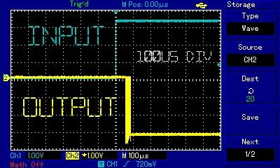
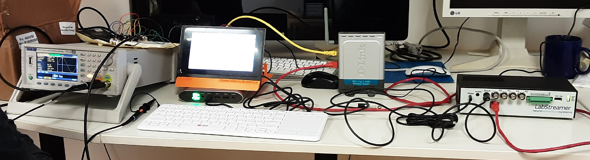
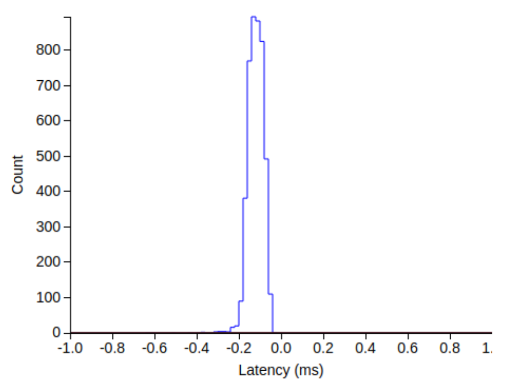
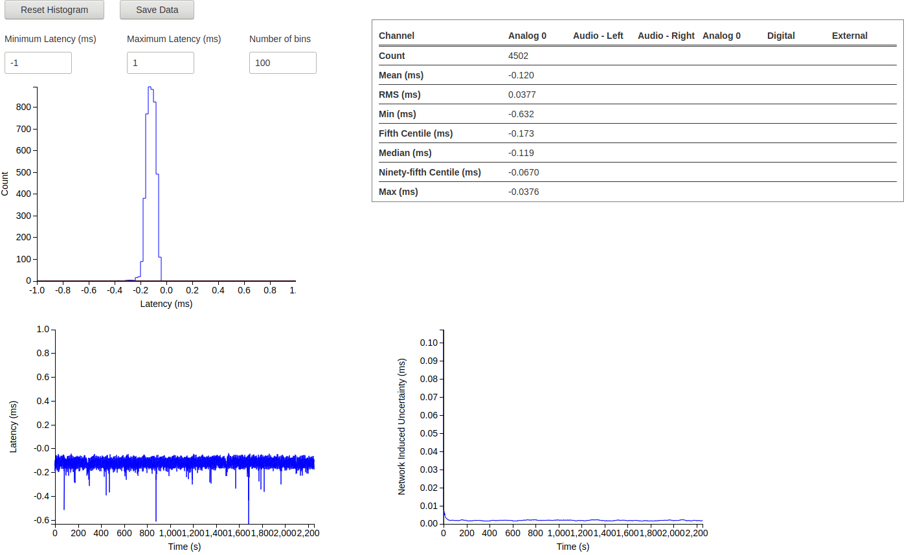

Validation
==========

The prototype was validated in four steps: physical layer, network (LSL)
layer, evoked potentials in humans, and the effect of jitter on
steady-state gamma oscillations.

1. Signal generator and oscilloscope
-------------------------------------

A TTi TGF4042 (40 MHz function/arbitrary/pulse generator) was connected to
a UNI-T UTD2025CL (25 MHz digital oscilloscope) and, in parallel, to the
prototype. The oscilloscope compared the generator signal with the output of
the prototype.

**Result:** latency below 100 µs over 4000 samples. That is more than ten
times better than the 1 ms tolerance required for EEG research.

   Light blue: generator signal. Yellow: prototype output.

2. Reference device LabStreamer (LSL)
-------------------------------------

The same generator (2 Hz square wave) was connected directly to a GPIO pin
of the prototype and to an analog input of the LabStreamer, a reference
device for LSL timing.

**Result:** 4502 events, median latency 119 µs, worst case 0.65 ms. This
confirms that the device meets the requirement even including network
communication.

   Setup: generator (left), prototype (middle), LabStreamer (right).

   Histogram of latencies.

   Detailed LabStreamer report: histogram, statistics and network stability.

Measuring jitter without a reference device
^^^^^^^^^^^^^^^^^^^^^^^^^^^^^^^^^^^^^^^^^^^

Only a signal generator is needed. Let :math:`e_i` be the (unknown) latency
error of event :math:`i`. From the time stamps we measure the interval
between successive events and its error against the known generator period,
:math:`\varepsilon_i = e_{i+1} - e_i`. If successive latencies are not
autocorrelated,

.. math::

   \operatorname{var}(\varepsilon) = 2\,\operatorname{var}(e)

so the jitter can be estimated as :math:`\operatorname{var}(e) =
\operatorname{var}(\varepsilon)/2`, without knowing the true timing.

3. Visual evoked potentials with human volunteers
-------------------------------------------------

A volunteer was stimulated with an alternating checkerboard and fixation
cross (600 ms each), a standard paradigm with a strong visual cortex
response. The stimulation was programmed in OpenSesame (Python 3). EEG was
recorded with a Magstim-EGI GTEN high-density system, 256 channels, 1000 Hz,
24 bit. The prototype was compared with the AV tester, the manufacturer's
device for calibrating stimulation with the Magstim-EGI system.

.. list-table::
   :widths: 50 50

   * - .. figure:: images/vep-checkerboard.png
     - .. figure:: images/vep-fixation.png

Data were analysed in BESA. Source localization, equivalent dipole
positions and orientations, and time courses agree very closely between the
AV tester (left) and the Synchro device (right).

.. list-table::
   :widths: 50 50

   * - .. figure:: images/vep-source-avtester.png

          AV tester

     - .. figure:: images/vep-source-synchro.png

          Synchro device

   * - .. figure:: images/vep-dipole-avtester.png

          AV tester, single dipole fit

     - .. figure:: images/vep-dipole-synchro.png

          Synchro device, single dipole fit

4. Auditory steady-state response (ASSR) and simulated jitter
-------------------------------------------------------------

One volunteer was presented with 500 auditory 40 Hz stimuli of 500 ms each.
With precise synchronization, the time-frequency map shows a strong response
at 40 Hz and its harmonics at 80 and 120 Hz, in line with the literature.

To show the effect of jitter, Gaussian random delays with a standard
deviation of 2 ms and 6 ms were added to the stimulus time stamps.

.. list-table::
   :widths: 33 33 33

   * - .. figure:: images/assr-jitter-0ms.png

          no jitter

     - .. figure:: images/assr-jitter-2ms.png

          2 ms jitter

     - .. figure:: images/assr-jitter-6ms.png

          6 ms jitter

* **2 ms:** the 80 and 120 Hz harmonics are almost completely lost and the
  main 40 Hz effect drops by about 40 %. Higher frequencies suffer more,
  because the same time shift is a larger phase shift at a higher frequency.
* **6 ms:** the measurable effect almost vanishes. The 40 Hz component is
  close to the pre-stimulus noise level (t = -0.2 to 0 s).

Summary
-------

* GPIO interrupt handling gives hardware latency below 100 µs.
* Including the LSL network layer, 4500 events had a median latency of
  about 120 µs and a worst case of 0.63–0.65 ms.
* VEP results with the prototype match those with the AV tester.
* Random jitter of only 2 ms already causes a significant loss of
  information in EEG analysis. Precise synchronization avoids it.
